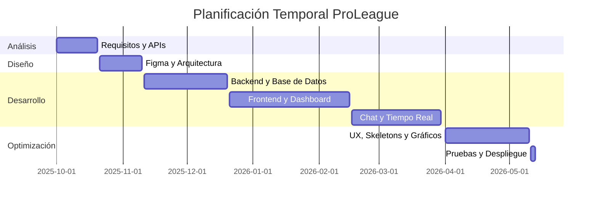

# Memoria del Proyecto — ProLeague

## 1. Portada

- **Alumno:** Andoni Villanueva Urrestarazu
- **Ciclo:** Desarrollo de Aplicaciones Multiplataforma — 2º curso
- **Proyecto:** ProLeague — Plataforma de Análisis Deportivo NBA/NFL
- **Centro:** Maria Ana Sanz
- **Curso Académico:** 2025-2026

---

## 2. Índice

1. Portada
2. Índice
3. Resumen / Abstract
4. Descripción y justificación del proyecto
5. Objetivos del proyecto (PMV + Ampliaciones)
6. Recursos hardware, software y arquitectura
7. Fases del desarrollo
8. Conclusiones
9. Bibliografía y referencias

---

## 3. Resumen

ProLeague es una plataforma web avanzada diseñada para el análisis, seguimiento y dinamización comunitaria de las dos grandes ligas deportivas estadounidenses: la NBA y la NFL. El propósito general del proyecto es ofrecer una herramienta centralizada que combine datos estadísticos en tiempo real con una experiencia social moderna. La aplicación permite consultar clasificaciones vivas, resultados recientes, noticias de última hora, y ofrece herramientas exclusivas como un constructor de "Dream Teams", comparadores de jugadores mediante gráficos interactivos y un sistema de chat persistente.

Tecnológicamente, se trata de una aplicación web "Single Page Application" (SPA) en su concepto, utilizando JavaScript modular en el frontend y un robusto backend en Node.js. Los resultados esperados se han cumplido ampliamente, logrando una plataforma estable, escalable y con una interfaz visual premium basada en la estética *Glassmorphism*.

### Abstract

ProLeague is an advanced web platform designed for the analysis, monitoring, and community engagement of the two major American sports leagues: the NBA and the NFL. The project's general purpose is to provide a centralized tool that combines real-time statistical data with a modern social experience. The application allows users to consult live standings, recent game scores, breaking news, and offers exclusive tools such as a "Dream Team" builder, player comparison features using interactive charts, and a persistent live chat system.

Technically, it is a web application using modular JavaScript on the frontend and a robust Node.js backend. The expected results have been widely achieved, resulting in a stable, scalable platform with a premium visual interface based on the *Glassmorphism* aesthetic.

---

## 4. Descripción y justificación del proyecto

ProLeague resuelve la dispersión de información deportiva y la falta de herramientas de análisis visual para aficionados. Está dirigida a usuarios que buscan una experiencia más profunda que el simple marcador, permitiéndoles interactuar con la comunidad y visualizar el rendimiento de sus jugadores favoritos.

### 4.1. Justificación de la necesidad

- **Centralización:** Unifica noticias, datos y comunidad en un solo lugar.
- **Análisis Visual:** Transforma números fríos de una tabla en gráficos radar y comparativas visuales.
- **Comunidad Activa:** Fomenta el debate mediante chats por liga y comentarios en noticias en tiempo real.
- **Sin Publicidad:** A diferencia de las plataformas oficiales o de apuestas, ProLeague se centra 100% en el usuario y los datos.

### 4.2. Comparativa con soluciones existentes

| Característica | ProLeague | Apps Oficiales | Flashscore |
|---|---|---|---|
| **Comparativa Visual** | ✅ Gráficos Radar | ❌ Tablas | ❌ Texto |
| **Dream Team Builder** | ✅ NBA + NFL | ❌ | ❌ |
| **Chat en Vivo** | ✅ Persistente + Bot | ❌ | ❌ |
| **Estética** | Glassmorphism / Dark | Estándar | Básico |
| **Privacidad** | Sin rastreadores | Alto rastreo | Publicidad apuestas |

---

## 5. Objetivos del proyecto

### 5.1. Producto Mínimo Viable (PMV)

Los siguientes objetivos constituyeron el núcleo funcional obligatorio de la aplicación:

- **Autenticación Segura:** Sistema de registro e inicio de sesión con hasheo de contraseñas (bcrypt) y verificación de identidad por email.
- **Consumo de APIs Deportivas:** Integración con BallDontLie y ESPN para obtener datos de 62 equipos y miles de jugadores en tiempo real.
- **Dashboard de Clasificaciones:** Tablas dinámicas con filtros por liga.
- **Comunicación en Tiempo Real:** Chat funcional mediante WebSockets.
- **Perfil de Usuario:** Gestión básica de avatar y biografía.

### 5.2. Ampliaciones y Mejoras (Implementadas)

Se han añadido funcionalidades que elevan la calidad del proyecto a un nivel profesional:

- **Dream Team 2.0:** Constructor interactivo de quintetos con validación de posiciones.
- **Analítica Avanzada:** Gráficos de "Home vs Away", "Rachas de victorias" y comparador radar (Chart.js).
- **Sistema de Comunidad:** Búsqueda de usuarios, perfiles públicos y sistema de "Likes" y comentarios en noticias.
- **Optimización UX (Wow Effect):**
    - **Skeleton Screens:** Carga elegante de datos evitando saltos visuales.
    - **Navigation Guard:** Modal premium que avisa si intentas salir del Dream Team sin guardar.
    - **Session Guard:** Evita que un mismo usuario abra dos sesiones simultáneas.
- **Caché Inteligente:** Sistema de almacenamiento temporal en backend para evitar bloqueos por exceso de peticiones a las APIs (Error 429).

---

## 6. Recursos hardware, software y arquitectura

### 6.1. Recursos necesarios

**Hardware:**
- Entorno de desarrollo: Portátil con procesador i7, 16GB RAM, Windows 11.
- Despliegue: Infraestructura Cloud distribuida (Render + Vercel).

**Software (Tecnologías Clave):**
- **Frontend:** HTML5, CSS3 (Variables CSS, Flexbox, Grid), JavaScript (ES6 Modules).
- **Backend:** Node.js, Express.js.
- **Bases de Datos:** MySQL (Gestión de usuarios legacy) y Firebase Firestore (Tiempo real).
- **Librerías:** Chart.js, Socket.io, Cheerio (RSS parsing), Bcrypt, Multer.

### 6.2. Arquitectura del proyecto

La arquitectura es un modelo Cliente-Servidor con un backend actuando como proxy de seguridad y caché para APIs externas.

[IMAGEN: DIAGRAMA DE ARQUITECTURA]
*(Referencia: Diagrama que muestra la conexión entre Frontend (Vercel) -> Backend (Render) -> APIs/Firestore)*

### 6.3. Estimación de Costes y Esfuerzo

Aunque el software utilizado es de código abierto (0€), una implementación profesional requeriría la siguiente inversión de esfuerzo:

| Fase | Horas estimadas | Descripción |
|---|---|---|
| Análisis y Requisitos | 25h | Definición de funcionalidades y mapeo de APIs. |
| Diseño de Interfaz | 30h | Mockups en Figma y definición de sistema de colores. |
| Desarrollo Backend | 50h | Implementación de proxy, caché, chat y seguridad. |
| Desarrollo Frontend | 70h | Vistas, lógica de JS, integración de gráficos y UX. |
| Pruebas y Despliegue | 25h | Depuración de errores 429, CORS y despliegue final. |
| **Total** | **200h** | **Equivalente a ~5.000€ de coste laboral.** |

---

## 7. Fases del desarrollo

### 7.1. Planificación Temporal (Diagrama de Gantt)

El proyecto se ha desarrollado siguiendo una metodología iterativa a lo largo del curso académico.



### 7.2. Fase de análisis (Requisitos funcionales)

Cada requisito cuenta con un código identificativo utilizado durante el desarrollo y las pruebas.

- **[AUTH-01] Registro:** Permitir a nuevos usuarios unirse al sistema validando email único.
- **[USER-03] Dream Team:** El usuario puede seleccionar jugadores para su equipo ideal. Prioridad: Alta.
- **[CHAT-01] Salas de Chat:** Comunicación bidireccional filtrada por temática. Prioridad: Media.
- **[NEWS-01] Interacción:** El usuario puede dejar su opinión en las noticias de la liga. Prioridad: Baja (Ampliación).

### 7.2. Fase de diseño

Se optó por una interfaz **Modern Dark** con **Glassmorphism**.
- **Colores:** Cyan Eléctrico (#00f2ff) para destacar, sobre fondo azul profundo (#0f172a).
- **Tipografía:** Arial / Roboto por su legibilidad técnica.

[IMAGEN: GUÍA DE ESTILOS Y COLORES]

### 7.3. Fase de diseño técnico

**Arquitectura de Datos (Dual-DB System):**
El proyecto utiliza un enfoque híbrido para maximizar el rendimiento:
- **MySQL:** Se encarga de la persistencia de identidad básica y credenciales, garantizando integridad referencial tradicional.
- **Cloud Firestore:** Maneja todos los datos volátiles y de tiempo real (chat, dream teams, favoritos, comentarios). Esto permite que cuando un usuario comenta una noticia, todos los demás vean el comentario instantáneamente sin refrescar, gracias al listener `onSnapshot`.

**Diagrama de Navegación y Casos de Uso:**
[IMAGEN: DIAGRAMA DE CASOS DE USO]
*(Muestra acciones: Registrarse, Gestionar Dream Team, Comparar Jugadores, Chatear).*

### 7.4. Fase de desarrollo e implementación

**Estructura del Repositorio:**
```text
ProLeaguePrincipal/
├── backend/                # Lógica Node.js / Express
│   ├── controllers/        # Controladores de noticias y auth
│   ├── routes/             # Definición de endpoints API
│   └── uploads/            # Almacenamiento de avatares
├── frontend/               # Cliente SPA-like
│   ├── css/                # Estilos Glassmorphism
│   ├── js/                 # Módulos ES6 (config, auth, leagues, analytics)
│   ├── logos/              # Activos locales (62 escudos NBA/NFL)
│   └── vistas/             # Estructura HTML organizada por módulos
└── package.json            # Gestión de dependencias
```

**Retos Técnicos Relevantes:**
1.  **Session Guard (Sesión Única):** Para evitar que un usuario comparta su cuenta, implementamos un sistema donde cada login genera un `sessionId` único guardado en Firestore. El cliente escucha este ID; si cambia desde otro dispositivo, la sesión actual se cierra automáticamente.
2.  **Unificación de Logos:** Debido a que consumimos APIs de diferentes proveedores (ESPN y BallDontLie), los IDs no coincidían. Creamos un `logos-config.js` centralizado que mapea los nombres de los equipos a archivos locales, garantizando que los escudos siempre se vean correctamente en toda la web.

Enlace al repositorio: [https://github.com/avillanurr10/ProyectoIntermodularAndoniVillanueva2dam.b.git](https://github.com/avillanurr10/ProyectoIntermodularAndoniVillanueva2dam.b.git)

### 7.5. Fase de pruebas y depuración (QA)

Se han realizado pruebas exhaustivas para garantizar la estabilidad del sistema.

| Código | Prueba Realizada | Resultado Esperado | Resultado Real | Estado |
|---|---|---|---|---|
| **TEST-01** | Carga de logos NFL | Los escudos deben aparecer en el modal. | Error 404 inicial. Corregido unificando rutas. | ✅ |
| **TEST-02** | Session Guard | Iniciar sesión en Chrome e Incógnito con la misma cuenta. | La primera sesión debe cerrarse automáticamente. | ✅ |
| **TEST-03** | Límite API | Realizar 50 búsquedas rápidas de jugadores. | El sistema debe servir datos desde caché sin bloquearse. | ✅ |
| **TEST-04** | Modal Salida | Intentar cerrar pestaña tras editar el Dream Team. | Debe aparecer el aviso premium de cambios sin guardar. | ✅ |
| **TEST-05** | Chat SQL Inject | Intentar enviar tags <script> en el chat. | El texto debe renderizarse como string plano sin ejecutarse. | ✅ |

### 7.5. Capturas de la Aplicación Final

[IMAGEN: CAPTURA HOME DASHBOARD]
*Dashboard principal con noticias y resultados en tiempo real.*

[IMAGEN: CAPTURA ANALYTICS NBA]
*Gráficos avanzados de balance de victorias y comparador de jugadores.*

[IMAGEN: CAPTURA DREAM TEAM BUILDER]
*Interfaz de selección de jugadores con validación de posiciones.*

---

## 8. Conclusiones

El desarrollo de ProLeague ha permitido integrar conocimientos complejos de arquitectura web, comunicación en tiempo real, gestión de bases de datos híbridas y despliegue en la nube.

**Logros principales:**
- Desarrollo de una plataforma completa que supera ampliamente el PMV propuesto inicialmente.
- Implementación exitosa de una arquitectura híbrida (MySQL + Firestore + Socket.io).
- Despliegue completo en producción con frontend y backend separados.
- Sistema de seguridad robusto (verificación email, session guard, bcrypt, CORS).
- Experiencia de usuario premium (glassmorphism, toasts, skeletons, animaciones).

**Mayores dificultades:**
- Integración fiable de APIs de terceros (errores 429) → solucionado con sistema de caché.
- Migración parcial a Firestore para tiempo real manteniendo autenticación en MySQL.

---

## 9. Bibliografía y referencias

- **Bcrypt.js** (2024). Optimized bcrypt in JavaScript. GitHub Repository. https://github.com/kelektiv/node.bcrypt.js
- **Chart.js Documentation** (2024). Open source HTML5 Charts for your website. https://www.chartjs.org/docs/
- **Cheerio.js** (2024). Fast, flexible, and lean implementation of core jQuery for the server. https://cheerio.js.org/
- **ESPN API** (2024). Public Standings and Scoreboard Endpoints. https://site.api.espn.com/
- **Express.js** (2024). Fast, unopinionated, minimalist web framework for Node.js. https://expressjs.com/
- **Firebase Documentation** (2024). Google Cloud Firestore and Authentication services. https://firebase.google.com/docs
- **MDN Web Docs** (2024). JavaScript (ES6), HTML5 and CSS3 Documentation. Mozilla Foundation. https://developer.mozilla.org/
- **Socket.io Documentation** (2024). Bidirectional and low-latency communication for every platform. https://socket.io/docs/v4/
- **Vercel Documentation** (2024). Deployment and hosting for modern web applications. https://vercel.com/docs
