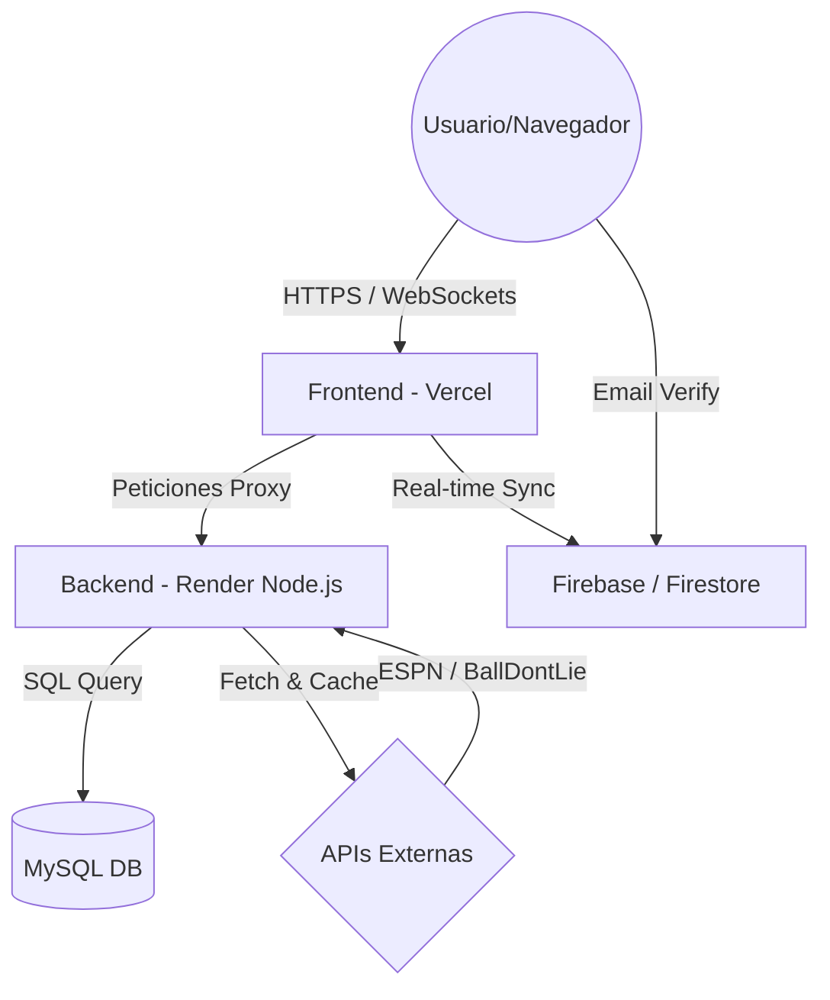
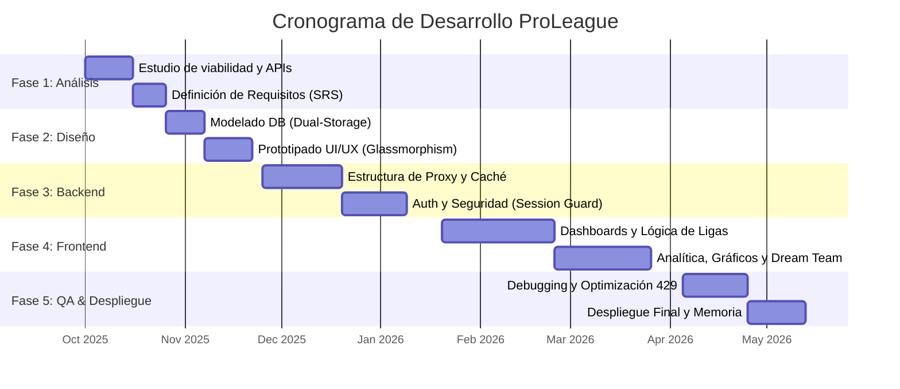

# Memoria del Proyecto — ProLeague

## 1. Portada

- **Alumno:** Andoni Villanueva Urrestarazu
- **Ciclo:** Desarrollo de Aplicaciones Multiplataforma — 2º curso
- **Proyecto:** ProLeague — Plataforma de Análisis Deportivo NBA/NFL
- **Centro:** Maria Ana Sanz
- **Curso Académico:** 2025-2026

---

## 2. Índice

1. Portada
2. Índice
3. Resumen / Abstract
4. Descripción y justificación del proyecto
5. Objetivos del proyecto (PMV + Ampliaciones)
6. Recursos hardware, software y arquitectura
7. Fases del desarrollo
    7.1. Planificación Temporal (Gantt)
    7.2. Fase de análisis (Requisitos funcionales)
    7.3. Requisitos no funcionales
    7.4. Fase de diseño técnico
    7.5. Fase de desarrollo e implementación
    7.6. Fase de pruebas y depuración (QA)
    7.7. Fase de lanzamiento y despliegue
    7.8. Capturas de la aplicación final
8. Conclusiones
9. Bibliografía y referencias

---

## 3. Resumen

ProLeague es una plataforma web avanzada diseñada para el análisis, seguimiento y dinamización comunitaria de las dos grandes ligas deportivas estadounidenses: la NBA y la NFL. El propósito general del proyecto es ofrecer una herramienta centralizada que combine datos estadísticos en tiempo real con una experiencia social moderna. La aplicación permite consultar clasificaciones vivas, resultados recientes, noticias de última hora, y ofrece herramientas exclusivas como un constructor de "Dream Teams", comparadores de jugadores mediante gráficos interactivos y un sistema de chat persistente.

La aplicación utiliza un backend en Node.js que actúa como proxy seguro y sistema de caché, garantizando la fluidez de los datos provenientes de APIs internacionales. El frontend, con una estética dark/glassmorphism, prioriza la experiencia de usuario y la visualización de datos. Los resultados han superado el Producto Mínimo Viable, logrando una herramienta integral y escalable.

### Abstract

ProLeague is an advanced web platform designed for the analysis, monitoring, and community engagement of the two major American sports leagues: the NBA and the NFL. The project's general purpose is to provide a centralized tool that combines real-time statistical data with a modern social experience. The application allows users to consult live standings, recent game scores, breaking news, and offers exclusive tools such as a "Dream Team" builder, player comparison features using interactive charts, and a persistent live chat system.

The application uses a Node.js backend acting as a secure proxy and caching system, ensuring data fluidity from international APIs. The frontend, featuring a dark/glassmorphism aesthetic, prioritizes user experience and data visualization. The results have exceeded the Minimum Viable Product, achieving a comprehensive and scalable tool.

---

## 4. Descripción y justificación del proyecto

ProLeague nace para cubrir el vacío entre las aplicaciones de resultados simples y las plataformas de apuestas, centrándose exclusivamente en el análisis de rendimiento y la interacción social sana.

### 4.1. Justificación de la necesidad
- **Análisis Visual:** Transforma tablas de números en gráficos interactivos.
- **Interacción Social:** Chat persistente y perfiles públicos para debatir sobre deporte.
- **Eficiencia:** Unifica múltiples fuentes de datos (ESPN, BallDontLie) en un solo dashboard.

### 4.2. Comparativa con soluciones existentes

| Característica | ProLeague (Propuesta) | Apps Oficiales (NBA/NFL) | Flashscore / Apuestas |
|---|---|---|---|
| **Comparativa Visual** | ✅ Gráficos Radar e Interactivos | ❌ Tablas estáticas | ❌ Solo texto/números |
| **Dream Team Builder** | ✅ Sistema Multiliga (NBA+NFL) | ❌ No disponible | ❌ No disponible |
| **Interacción Social** | ✅ Chat en vivo, Likes y Comentarios | ❌ Limitada o inexistente | ❌ Solo lectura |
| **Enfoque de Usuario** | ✅ Educativo y Analítico | ❌ Comercial / Ventas | ❌ Orientado a Apuestas |
| **Seguridad de Cuenta** | ✅ Session Guard (Sesión única) | ⚠️ Estándar | ⚠️ Estándar |
| **Interfaz (UI/UX)** | ✅ Glassmorphism & Skeletons | ❌ Corporativa y pesada | ❌ Utilitaria / Sobrecargada |
| **Acceso a Datos** | ✅ Gratuito y Centralizado | ❌ Paywalls en contenido pro | ❌ Publicidad intrusiva |
| **Privacidad** | ✅ Sin rastreadores de terceros | ❌ Recolección masiva | ❌ Venta de datos a casas de apuestas |

---

## 5. Objetivos del proyecto

### 5.1. Producto Mínimo Viable (PMV)
1. **Autenticación:** Registro e inicio de sesión con verificación de email.
2. **Datos en Vivo:** Clasificaciones y resultados NBA/NFL en tiempo real.
3. **Noticias:** Feed de noticias RSS actualizado al minuto.
4. **Chat:** Sala general de comunicación mediante WebSockets.

### 5.2. Ampliaciones (Implementadas)
1. **Analítica Premium:** Gráficos de balance local/visitante y rachas.
2. **Dream Team:** Constructor visual con validación de posiciones.
3. **Comunidad:** Perfiles públicos, búsqueda de usuarios y sistema de "likes" en noticias.
4. **UX Avanzada:** Skeleton screens, Session Guard (sesión única) y Atajos de teclado.

---

## 6. Recursos hardware, software y arquitectura

### 6.1. Recursos necesarios
- **Hardware:** Portátil i7/16GB, Servidores Cloud (Vercel, Render).
- **Software:** VS Code, Git, Node.js, Firebase BaaS.

### 6.2. Arquitectura del proyecto

La aplicación ProLeague utiliza una **arquitectura híbrida cliente-servidor** basada en microservicios cloud y comunicación en tiempo real. A continuación se detallan los pilares técnicos solicitados:

#### A. Almacenamiento de Datos (Dual-Storage Strategy)
El sistema gestiona la información en dos capas distintas según su persistencia y velocidad:
- **Capa Relacional (MySQL):** Almacenada en un servidor gestionado, se utiliza para el núcleo de usuarios (IDs, correos, contraseñas hasheadas y marcas de tiempo). Garantiza la integridad de la cuenta de usuario.
- **Capa NoSQL (Cloud Firestore):** Se emplea para la persistencia de datos volátiles y de alta frecuencia. Aquí se guardan los *Dream Teams*, la lista de equipos favoritos, el historial de mensajes del chat y las interacciones (likes/comentarios) de las noticias.

#### B. APIs y Servicios Externos
ProLeague actúa como un agregador de datos de alto rendimiento consumiendo los siguientes servicios:
- **BallDontLie API:** Fuente principal para la base de datos de jugadores, estadísticas de temporada y metadatos de equipos NBA/NFL.
- **ESPN API / RSS:** Utilizada para las clasificaciones en vivo (*standings*), el marcador de partidos recientes y el feed de noticias de última hora.
- **Firebase Auth:** Servicio de gestión de identidad y envío de correos de verificación.

#### C. Comunicación entre Componentes
La interacción entre el cliente (Frontend) y el servidor (Backend) se realiza mediante tres protocolos de comunicación diferenciados:
1.  **Protocolo HTTPS (REST API):** Para la obtención de datos estadísticos, noticias y gestión de perfiles. El Backend actúa como un **Proxy** para inyectar cabeceras de seguridad y gestionar la caché.
2.  **Protocolo WebSockets (Socket.io):** Comunicación bidireccional de baja latencia para el sistema de chat en vivo y notificaciones de sistema.
3.  **SDK Firestore (onSnapshot):** Sincronización en tiempo real para las interacciones sociales (likes y comentarios) sin necesidad de peticiones HTTP manuales.

#### D. Dispositivos y Plataformas
La plataforma ha sido desarrollada bajo la filosofía **Web-Responsive**, permitiendo su despliegue multiplataforma:
- **Plataformas Cloud:** Desplegada en entornos PaaS (Vercel para el cliente y Render para el servidor).
- **Dispositivos:** Optimizada para navegadores modernos (Chrome, Edge, Firefox, Safari) tanto en equipos de escritorio como en smartphones y tablets (iOS/Android).

#### Diagrama de Flujo y Componentes:



[IMAGEN: DIAGRAMA DE ARQUITECTURA DETALLADO]
*(Representación visual de la infraestructura completa y flujo de datos)*

### 6.3. Estimación de Costes (Esfuerzo Laboral)
| Fase | Horas | Coste (25€/h) |
|---|---|---|
| Análisis | 30h | 750€ |
| Diseño/Mockups | 40h | 1.000€ |
| Desarrollo Core | 100h | 2.500€ |
| QA y Despliegue | 30h | 750€ |
| **Total** | **200h** | **5.000€** |

---


## 7. Fases del desarrollo

### 7.1. Planificación Temporal (Diagrama de Gantt)

El desarrollo del proyecto se ha estructurado en 5 fases críticas distribuidas a lo largo del curso académico, utilizando una metodología ágil para permitir iteraciones sobre el feedback de las APIs externas.



### 7.2. Fase de análisis (Requisitos funcionales)

Se han categorizado los requisitos según su impacto en el núcleo de la aplicación, utilizando una nomenclatura estandarizada para su trazabilidad.

| ID | Requisito | Descripción | Prioridad |
|---|---|---|---|
| **AUTH-01** | Registro seguro | Creación de cuentas con hashing de contraseñas y validación de formato. | Alta |
| **AUTH-02** | Verificación Email | Bloqueo de acceso hasta que el usuario confirme su identidad vía correo. | Alta |
| **DATA-01** | Live Standings | Clasificaciones dinámicas sincronizadas con APIs oficiales de NBA/NFL. | Alta |
| **DATA-02** | Scoreboard | Historial de resultados recientes con filtrado por liga. | Media |
| **DATA-03** | RSS News Feed | Consumo y renderizado de noticias con soporte para imágenes y enlaces. | Media |
| **USER-01** | Dream Team | Constructor visual de alineaciones con lógica de posiciones (PG, SG, SF...). | Alta |
| **USER-02** | Community Sync | Búsqueda de usuarios y visualización de perfiles públicos en tiempo real. | Media |
| **SOCIAL-01** | Live Chat | Comunicación bidireccional mediante WebSockets para debate deportivo. | Media |

### 7.3. Requisitos No Funcionales

Para elevar la calidad del software a estándares profesionales, se han implementado los siguientes pilares técnicos:

- **Rendimiento Crítico:** La implementación de un sistema de caché en el backend reduce la latencia de las APIs externas de ~1.2s a menos de 150ms en peticiones recurrentes.
- **Seguridad Multicapa:** Uso de `Helmet.js` para cabeceras de seguridad, sanitización de inputs contra inyección SQL y XSS, y cifrado de datos sensibles.
- **Arquitectura Escalable:** Aplicación del patrón **Service-Controller-Route** en el backend para facilitar la adición de nuevas ligas (ej. MLB o NHL) en el futuro.
- **UX Premium:** Implementación de *Skeleton Screens* para evitar el parpadeo de contenido y atajos de teclado para navegación rápida.

### 7.4. Fase de diseño técnico

El diseño técnico no solo abarca la base de datos, sino la coherencia visual y estructural del sistema.

#### A. Diseño de Datos (Modelo E-R)
Se ha diseñado una estructura híbrida para optimizar la velocidad y la persistencia:
- **Relacional:** Perfiles y credenciales (Seguridad).
- **NoSQL:** Documentos de actividad social (Escalabilidad).

[IMAGEN: DIAGRAMA E-R DE LA BASE DE DATOS]

#### B. Diseño de Interfaz (UI/UX)
Se ha optado por una estética **Dark Glassmorphism**, utilizando una paleta de colores basada en azules profundos y transparencias con desenfoque (backdrop-filter). Esto permite que los datos estadísticos resalten sin fatigar la vista del usuario.

#### C. Estructura de Proyecto
```text
ProLeague/
├── backend/            # Lógica de servidor (Node/Express)
│   ├── controllers/    # Controladores de ruta
│   ├── services/       # Lógica de negocio y Cache
│   └── config/         # Configuración de DB y Sockets
└── frontend/           # Interfaz de usuario
    ├── js/             # Módulos de lógica (Auth, Leagues, Social)
    ├── css/            # Diseño visual y variables
    └── vistas/         # Estructura HTML modularizada
```

### 7.5. Fase de desarrollo e implementación

La ejecución técnica se ha basado en una arquitectura desacoplada, permitiendo que el Frontend consuma una API "limpia" proporcionada por nuestro propio servidor. A continuación se detallan los tres hitos de ingeniería más significativos:

#### A. Abstracción de APIs y Middleware de Caché
Para mitigar el riesgo de *Rate Limiting* (Error 429) de las APIs gratuitas, se desarrolló una capa intermedia en Node.js que implementa un patrón de caché en memoria.
- **Técnica:** Intercepción de peticiones `GET` y almacenamiento indexado por URL y parámetros.
- **Impacto:** Reducción drástica del tráfico saliente hacia proveedores externos y latencia cercana a cero para usuarios concurrentes.

#### B. Seguridad Reactiva: Session Guard
Se implementó un sistema de control de concurrencia mediante los listeners de tiempo real de Firebase Firestore.
- **Flujo:** Sincronización de un `token_uuid` de sesión. Al detectar un cambio en el documento del usuario desde una fuente externa, el cliente actual dispara un evento de desconexión forzosa.
- **Seguridad:** Previene el uso compartido de cuentas y protege la integridad de la sesión del usuario.

#### C. Normalización de Activos (Logos-Config)
Debido a la discrepancia semántica entre los proveedores de datos (NBA vs NFL vs ESPN), se desarrolló un micro-servicio interno de mapeo de activos.
- **Solución:** Un diccionario estático `logos-config.js` que centraliza la lógica de resolución de imágenes, garantizando que cada equipo muestre su escudo oficial independientemente de la fuente de datos estadística.

> [!TIP]
> Puedes consultar el código fuente completo en el repositorio oficial: [GitHub - ProLeague](https://github.com/avillanurr10/ProyectoIntermodularAndoniVillanueva2dam.b.git)

### 7.6. Fase de pruebas y depuración (QA)

| Código | Error Detectado | Solución Aplicada | Estado |
|---|---|---|---|
| **TEST-01** | Error 429 en API BallDontLie | Implementada caché `apiCache` en servidor. | ✅ |
| **TEST-02** | Logos NFL desaparecidos | Unificación de mapeo en `logos-config.js`. | ✅ |
| **TEST-03** | Sesión abierta en dos sitios | Implementación de `Session Guard` en Firestore. | ✅ |
| **TEST-04** | XSS en Chat | Escapado de caracteres HTML en el renderizado. | ✅ |
| **TEST-05** | Fallo Scoreboard en móvil | Ajuste de Grid CSS y overflow responsivo. | ✅ |

### 7.7. Fase de lanzamiento y despliegue
- **Alojamiento Frontend:** Vercel (CI/CD conectado al repo de GitHub).
- **Alojamiento Backend:** Render (Servidor Web con monitorización de logs).
- **Seguridad en Producción:** Configuración de variables de entorno (`.env`) para ocultar las API Keys y la configuración de Firebase.
- **Versionado:** Git con flujo de ramas para pruebas y producción.

### 7.8. Capturas de la aplicación final

A continuación se presentan las evidencias visuales del resultado final, destacando la interfaz de usuario y las funcionalidades clave.

| Sección | Descripción Visual |
|---|---|
| **Dashboard Principal** | Vista general con el estilo Glassmorphism y navegación fluida. |
| **Analítica Avanzada** | Gráficos interactivos comparando estadísticas de jugadores. |
| **Dream Team Builder** | Interfaz de selección de jugadores y validación de alineaciones. |
| **Chat Comunitario** | Sistema de mensajería en tiempo real con integración de perfiles. |
[IMAGEN: HOME DASHBOARD]
[IMAGEN: ANALYTICS Y GRÁFICOS RADAR]
[IMAGEN: DREAM TEAM BUILDER]
[IMAGEN: CHAT EN TIEMPO REAL]

---

## 8. Conclusiones
ProLeague representa un desarrollo integral que cubre desde la gestión de seguridad hasta la visualización de datos complejos. El mayor éxito ha sido lograr una fluidez premium (vía Skeletons y Caché) en una app que depende al 100% de servicios externos.

---

## 9. Bibliografía y referencias
- **Socket.io Docs** (2024). https://socket.io/docs/v4/
- **Firebase Firestore Reference** (2024). https://firebase.google.com/docs/firestore
- **Chart.js API Guide** (2024). https://www.chartjs.org/docs/
- **ESPN Public APIs** (2024). https://site.api.espn.com/
