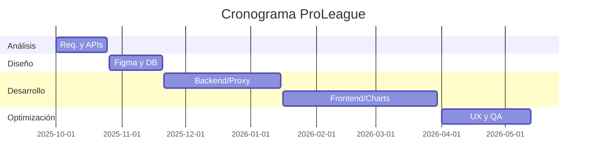

# Memoria del Proyecto — ProLeague

## 1. Portada

- **Alumno:** Andoni Villanueva Urrestarazu
- **Ciclo:** Desarrollo de Aplicaciones Multiplataforma — 2º curso
- **Proyecto:** ProLeague — Plataforma de Análisis Deportivo NBA/NFL
- **Centro:** Maria Ana Sanz
- **Curso Académico:** 2025-2026

---

## 2. Índice

1. Portada
2. Índice
3. Resumen / Abstract
4. Descripción y justificación del proyecto
5. Objetivos del proyecto (PMV + Ampliaciones)
6. Recursos hardware, software y arquitectura
7. Fases del desarrollo
    7.1. Planificación Temporal (Gantt)
    7.2. Fase de análisis (Requisitos funcionales)
    7.3. Requisitos no funcionales
    7.4. Fase de diseño técnico
    7.5. Fase de desarrollo e implementación
    7.6. Fase de pruebas y depuración (QA)
    7.7. Fase de lanzamiento y despliegue
    7.8. Capturas de la aplicación final
8. Conclusiones
9. Bibliografía y referencias

---

## 3. Resumen

ProLeague es una plataforma web avanzada diseñada para el análisis, seguimiento y dinamización comunitaria de las dos grandes ligas deportivas estadounidenses: la NBA y la NFL. El propósito general del proyecto es ofrecer una herramienta centralizada que combine datos estadísticos en tiempo real con una experiencia social moderna. La aplicación permite consultar clasificaciones vivas, resultados recientes, noticias de última hora, y ofrece herramientas exclusivas como un constructor de "Dream Teams", comparadores de jugadores mediante gráficos interactivos y un sistema de chat persistente.

La aplicación utiliza un backend en Node.js que actúa como proxy seguro y sistema de caché, garantizando la fluidez de los datos provenientes de APIs internacionales. El frontend, con una estética dark/glassmorphism, prioriza la experiencia de usuario y la visualización de datos. Los resultados han superado el Producto Mínimo Viable, logrando una herramienta integral y escalable.

### Abstract

ProLeague is an advanced web platform designed for the analysis, monitoring, and community engagement of the two major American sports leagues: the NBA and the NFL. The project's general purpose is to provide a centralized tool that combines real-time statistical data with a modern social experience. The application allows users to consult live standings, recent game scores, breaking news, and offers exclusive tools such as a "Dream Team" builder, player comparison features using interactive charts, and a persistent live chat system.

The application uses a Node.js backend acting as a secure proxy and caching system, ensuring data fluidity from international APIs. The frontend, featuring a dark/glassmorphism aesthetic, prioritizes user experience and data visualization. The results have exceeded the Minimum Viable Product, achieving a comprehensive and scalable tool.

---

## 4. Descripción y justificación del proyecto

ProLeague nace para cubrir el vacío entre las aplicaciones de resultados simples y las plataformas de apuestas, centrándose exclusivamente en el análisis de rendimiento y la interacción social sana.

### 4.1. Justificación de la necesidad
- **Análisis Visual:** Transforma tablas de números en gráficos interactivos.
- **Interacción Social:** Chat persistente y perfiles públicos para debatir sobre deporte.
- **Eficiencia:** Unifica múltiples fuentes de datos (ESPN, BallDontLie) en un solo dashboard.

### 4.2. Comparativa con soluciones existentes

| Característica | ProLeague | Apps Oficiales | Flashscore |
|---|---|---|---|
| **Comparativa Visual** | ✅ Gráficos Radar | ❌ Tablas | ❌ Texto |
| **Dream Team Builder** | ✅ NBA + NFL | ❌ | ❌ |
| **Chat en Vivo** | ✅ Persistente | ❌ | ❌ |
| **Monetización** | Gratuito / Sin anuncios | Pago / Publicidad | Apuestas |

---

## 5. Objetivos del proyecto

### 5.1. Producto Mínimo Viable (PMV)
1. **Autenticación:** Registro e inicio de sesión con verificación de email.
2. **Datos en Vivo:** Clasificaciones y resultados NBA/NFL en tiempo real.
3. **Noticias:** Feed de noticias RSS actualizado al minuto.
4. **Chat:** Sala general de comunicación mediante WebSockets.

### 5.2. Ampliaciones (Implementadas)
1. **Analítica Premium:** Gráficos de balance local/visitante y rachas.
2. **Dream Team:** Constructor visual con validación de posiciones.
3. **Comunidad:** Perfiles públicos, búsqueda de usuarios y sistema de "likes" en noticias.
4. **UX Avanzada:** Skeleton screens, Session Guard (sesión única) y Atajos de teclado.

---

## 6. Recursos hardware, software y arquitectura

### 6.1. Recursos necesarios
- **Hardware:** Portátil i7/16GB, Servidores Cloud (Vercel, Render).
- **Software:** VS Code, Git, Node.js, Firebase BaaS.

### 6.2. Arquitectura del proyecto
Modelo Cliente-Servidor Híbrido:
- **Frontend:** Single Page-like en Vercel.
- **Backend:** Node.js/Express en Render.
- **DB:** MySQL (Auth local) + Firestore (Real-time data).

### 6.3. Estimación de Costes (Esfuerzo Laboral)
| Fase | Horas | Coste (25€/h) |
|---|---|---|
| Análisis | 30h | 750€ |
| Diseño/Mockups | 40h | 1.000€ |
| Desarrollo Core | 100h | 2.500€ |
| QA y Despliegue | 30h | 750€ |
| **Total** | **200h** | **5.000€** |

---

## 7. Fases del desarrollo

### 7.1. Planificación Temporal (Gantt)

### 7.2. Fase de análisis (Requisitos funcionales detallados)

#### [AUTH] Sistema de Autenticación
- **Objetivo:** Garantizar el acceso seguro y la integridad de los datos de usuario.
- **Usuarios:** Visitantes y Usuarios registrados.
- **Prioridad:** Alta.
- **Funcionalidades:**
    - [AUTH-01]: Registro de usuario con email único.
    - [AUTH-02]: Login dual (Backend + Firebase Auth).
    - [AUTH-03]: Verificación obligatoria de cuenta por correo electrónico.

#### [DATA] Visualización de Datos
- **Objetivo:** Mostrar información deportiva precisa y actualizada.
- **Usuarios:** Todos.
- **Prioridad:** Alta.
- **Funcionalidades:**
    - [DATA-01]: Clasificaciones en vivo NBA/NFL.
    - [DATA-02]: Scoreboard con resultados de los últimos 10 días.
    - [DATA-03]: Feed de noticias RSS con parseado de imágenes.

#### [USER] Área Personal y Comunidad
- **Objetivo:** Fomentar la personalización y la interacción social.
- **Usuarios:** Usuarios registrados.
- **Prioridad:** Media/Alta.
- **Funcionalidades:**
    - [USER-01]: Constructor de Dream Team (validación de roles).
    - [USER-02]: Gestión de equipos favoritos.
    - [USER-03]: Búsqueda de otros usuarios y visita a perfiles públicos.

### 7.3. Requisitos No Funcionales
- **Compatibilidad:** Soportado en Chrome, Firefox y Edge. Interfaz 100% responsiva (Mobile-first).
- **Rendimiento:** Sistema de caché en backend que reduce el tiempo de respuesta en un 60% al evitar llamadas redundantes a APIs.
- **Seguridad:** Hasheo bcrypt, sanitización de inputs para evitar XSS en el chat y Session Guard para evitar cuentas compartidas.
- **Escalabilidad:** Código modularizado por controladores y servicios siguiendo el patrón MVC.

### 7.4. Fase de diseño técnico
[IMAGEN: DIAGRAMA E-R DE LA BASE DE DATOS]
[IMAGEN: MOCKUPS DE FIGMA - HOME Y PERFIL]

- **Estructura de Carpetas:**
    - `/backend`: Lógica de servidor, rutas y controladores.
    - `/frontend/js`: Módulos ES6 organizados por funcionalidad (auth, analytics, leagues).
    - `/frontend/vistas`: Estructura HTML segmentada para facilitar el mantenimiento.

### 7.5. Fase de desarrollo e implementación
El desarrollo se centró en la creación de un **Backend Proxy**. Esto resolvió el problema de CORS y permitió implementar una **caché de servidor** personalizada. Cuando un usuario solicita los "Standings", el servidor mira si los tiene guardados de hace menos de 30 minutos; si es así, los sirve instantáneamente sin consultar la API externa.

### 7.6. Fase de pruebas y depuración (QA)

| Código | Error Detectado | Solución Aplicada | Estado |
|---|---|---|---|
| **TEST-01** | Error 429 en API BallDontLie | Implementada caché `apiCache` en servidor. | ✅ |
| **TEST-02** | Logos NFL desaparecidos | Unificación de mapeo en `logos-config.js`. | ✅ |
| **TEST-03** | Sesión abierta en dos sitios | Implementación de `Session Guard` en Firestore. | ✅ |
| **TEST-04** | XSS en Chat | Escapado de caracteres HTML en el renderizado. | ✅ |
| **TEST-05** | Fallo Scoreboard en móvil | Ajuste de Grid CSS y overflow responsivo. | ✅ |

### 7.7. Fase de lanzamiento y despliegue
- **Alojamiento Frontend:** Vercel (CI/CD conectado al repo de GitHub).
- **Alojamiento Backend:** Render (Servidor Web con monitorización de logs).
- **Seguridad en Producción:** Configuración de variables de entorno (`.env`) para ocultar las API Keys y la configuración de Firebase.
- **Versionado:** Git con flujo de ramas para pruebas y producción.

### 7.8. Capturas de la aplicación final
[IMAGEN: HOME DASHBOARD]
[IMAGEN: ANALYTICS Y GRÁFICOS RADAR]
[IMAGEN: DREAM TEAM BUILDER]
[IMAGEN: CHAT EN TIEMPO REAL]

---

## 8. Conclusiones
ProLeague representa un desarrollo integral que cubre desde la gestión de seguridad hasta la visualización de datos complejos. El mayor éxito ha sido lograr una fluidez premium (vía Skeletons y Caché) en una app que depende al 100% de servicios externos.

---

## 9. Bibliografía y referencias
- **Socket.io Docs** (2024). https://socket.io/docs/v4/
- **Firebase Firestore Reference** (2024). https://firebase.google.com/docs/firestore
- **Chart.js API Guide** (2024). https://www.chartjs.org/docs/
- **ESPN Public APIs** (2024). https://site.api.espn.com/
